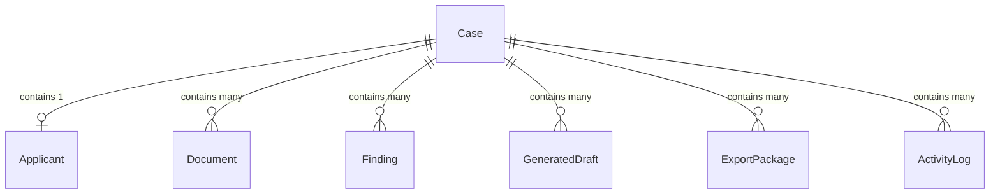

# Supabase Architecture

## Auth Roles

### Reviewer
- **Responsibilities**: Conduct document review, accept/resolve findings, generate drafts.
- **Permissions**:
  - Read assigned Cases.
  - Read Applicant Documents.
  - Read/Write Findings.
  - Read/Write Generated Drafts.
  - Update Case status to "Reviewed".
- **Restrictions**:
  - Cannot delete Cases.
  - Cannot access system settings.
  - Cannot export packages without supervisor approval (depending on final configuration).

### Supervisor
- **Responsibilities**: Oversee reviewers, resolve escalated findings, approve and generate final Export Packages.
- **Permissions**:
  - Read/Write all Cases.
  - Manage all Findings and Drafts.
  - Generate Export Packages.
  - Reassign cases.
- **Restrictions**:
  - Cannot modify global organization configurations or billing.

### Admin
- **Responsibilities**: System configuration, user management, and template management.
- **Permissions**:
  - Full access to all tables and configurations.
  - Manage Auth Roles.
- **Restrictions**:
  - None within the tenant scope.

## Storage Buckets

### `documents`
- **Purpose**: Stores raw applicant uploads (PDFs, JPGs, PNGs) such as PSA Birth Certificates and TORs. Secure, private bucket accessible only via authenticated signed URLs.

### `exports`
- **Purpose**: Stores finalized and bundled Export Packages (PDFs/ZIPs). Read-only for Reviewers, read/write for Supervisors.

### `templates`
- **Purpose**: Stores the raw HTML or Word templates used by the Draft Generation engine. Managed by Admins.

## Database Strategy

### Root Entity: `Case`
The `Case` is the primary bounded context. All actions, files, and findings are scoped to a specific `Case`.

## Row Level Security (RLS) Strategy
- RLS will be enabled on **all** tables.
- Authentication will be enforced via Supabase Auth (JWTs).
- Access policies will filter rows based on the `auth.uid()` and their associated Role.
- All application data tables will have a `case_id` to streamline RLS policies (e.g., `user has access to case_id`).
